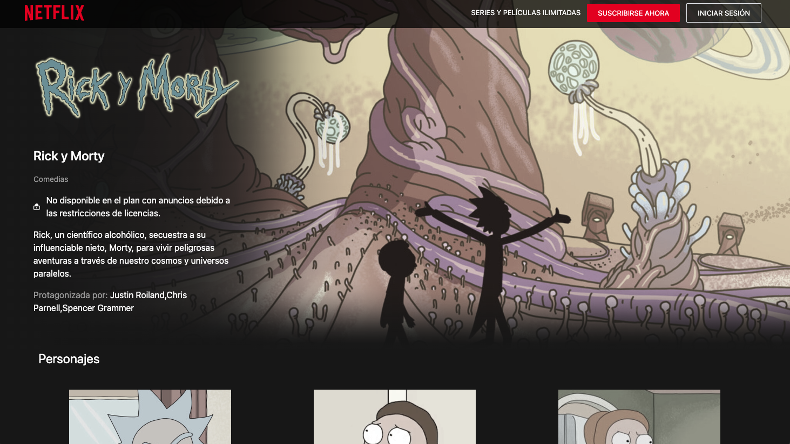

# Netflix clone

This project was created with React & Tailwind css and also used the [Rick & Morty API](https://rickandmortyapi.com/api/character).




## Built With 🚀


## Getting started  🔧

Clone the repository

```sh
npm clone https://github.com/mauricioyair/Netflix-clone.git
```

Install dependency
```sh
npm install
```

In the project directory, you can run:

```sh
npm run dev
```

Or watch the live [demo](https://mauricioyair.github.io/To-do)
